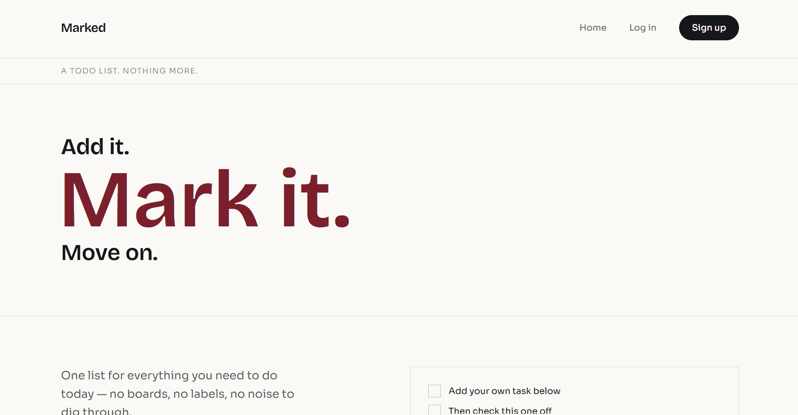
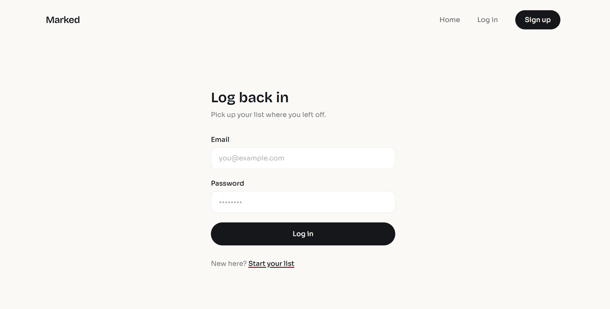
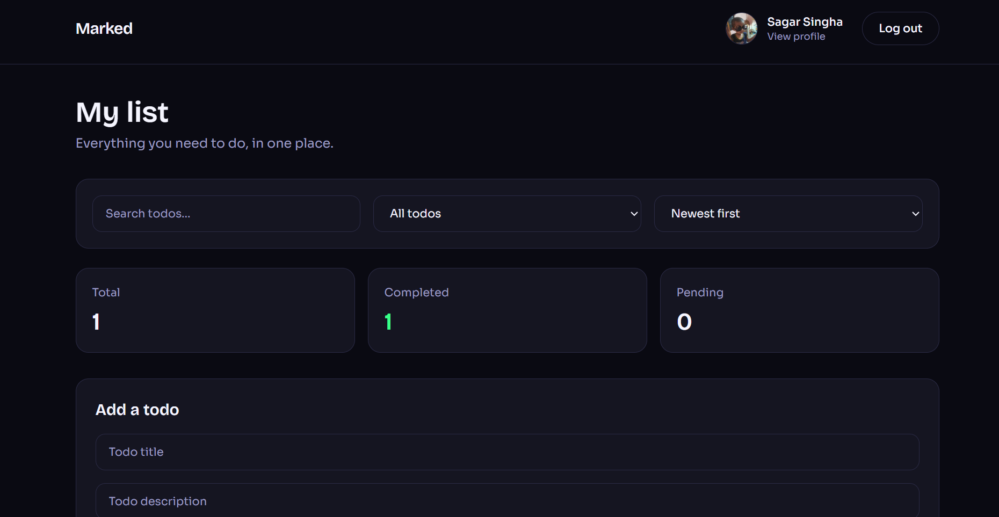
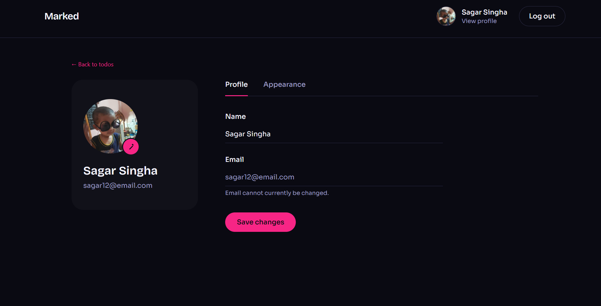
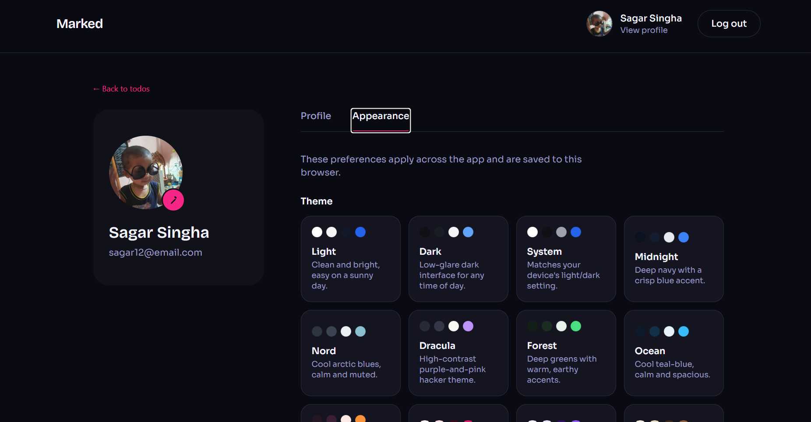
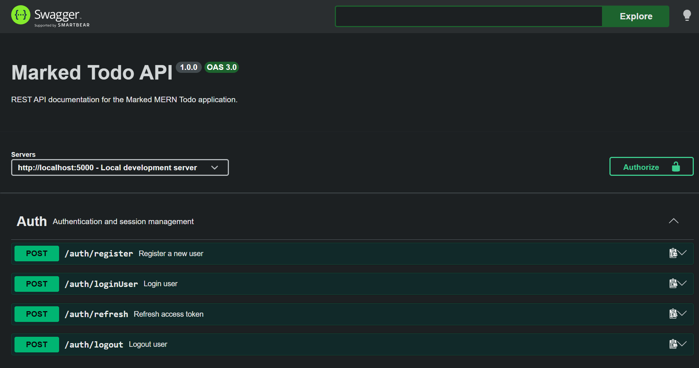

# Marked — Production-Ready MERN Todo Application

A full-stack Todo application built with the MERN stack, designed with production-oriented authentication, refresh-token rotation, security controls, user profiles, customizable themes, multiple Todo layouts, automated testing, and API documentation.

## Live Application

**Frontend:**
https://full-stack-mern-todo-ten.vercel.app

**Backend API:**
https://full-stack-mern-todo.onrender.com

**API Documentation:**
https://full-stack-mern-todo.onrender.com/api-docs

**GitHub Repository:**
https://github.com/sagarsingha95/Full-stack-Mern_Todo

---


# Screenshots

## Landing Page



## Login Page



## Todo Dashboard



## Profile



## Theme



## API Documentation



# Overview

Marked is a production-focused full-stack Todo application built to go beyond basic CRUD functionality.

The project demonstrates:

* Full-stack MERN architecture
* JWT authentication
* Access and refresh token flow
* Refresh-token rotation
* Refresh-token reuse detection
* Secure HttpOnly cookies
* User-owned Todo authorization
* Search, filtering, sorting, and pagination
* User profile management
* Cloudinary avatar uploads
* Multiple UI themes
* Multiple Todo layouts
* Rate limiting
* API validation
* Automated integration/security testing
* Swagger/OpenAPI documentation
* Production deployment

---

# Tech Stack

## Frontend

* React
* Vite
* React Router
* Tailwind CSS
* Context API
* JavaScript
* Fetch API

## Backend

* Node.js
* Express
* MongoDB
* Mongoose
* JSON Web Tokens
* bcryptjs
* Cookie Parser
* Express Rate Limit
* Helmet
* CORS
* Express Validator
* Multer
* Cloudinary

## Testing

* Jest
* Supertest

## Production Infrastructure

* Vercel — frontend hosting
* Render — backend hosting
* MongoDB Atlas — production database
* Cloudinary — profile image storage

---

# Features

## Authentication

Users can:

* Register
* Login
* Logout
* Remain authenticated using refresh tokens
* Automatically receive a new access token when an access token expires

Access tokens are short-lived while refresh tokens are stored using secure HttpOnly cookies.

---

# Refresh Token Architecture

The application implements refresh-token rotation instead of relying on a single long-lived token.

Each refresh session stores:

* User ID
* Token family ID
* SHA-256 token hash
* Expiration time
* Revocation state
* Revocation timestamp
* IP address
* User agent
* Last-used timestamp

The raw refresh token is never stored in MongoDB.

## Token Rotation

When a refresh token is used:

1. The token is verified.
2. Its SHA-256 hash is generated.
3. The corresponding refresh session is located.
4. The existing session is revoked.
5. A new access token is generated.
6. A new refresh token is generated.
7. The new refresh token is hashed.
8. A new refresh session is stored.
9. The browser receives the new refresh token through an HttpOnly cookie.

## Refresh Token Reuse Detection

If an already-revoked refresh token is used again, the application treats it as possible token theft.

All active sessions belonging to that refresh-token family are revoked and the user must authenticate again.

---

# Todo Management

Each Todo belongs to the authenticated user.

Users can:

* Create Todos
* View Todos
* Edit Todos
* Delete Todos
* Mark Todos as completed
* Set priority
* Search Todos
* Filter Todos
* Sort Todos
* Paginate Todo results

Users cannot modify or delete Todos owned by another account.

---

# Search, Filtering and Sorting

The Todo API supports server-side queries for:

### Search

Search Todos by title.

### Filter

* All
* Pending
* Completed

### Sorting

* Newest
* Oldest
* A–Z
* Z–A
* Priority

### Pagination

Todo results are paginated to avoid returning unnecessarily large datasets.

---

# User Profile

Authenticated users can:

* View their profile
* Update their name
* Upload a profile picture
* Replace an existing profile picture

Profile pictures are uploaded using Multer and stored on Cloudinary.

Supported image formats:

* JPEG
* PNG
* WEBP

Maximum file size:

```text
5 MB
```

Previous Cloudinary profile images are removed when the user uploads a replacement.

---

# Appearance Customization

Marked includes a customizable appearance system.

Users can choose from multiple themes and Todo presentation styles.

Theme and layout preferences are persisted locally so the selected interface remains after refreshing the browser.

The application includes more than ten visual themes and multiple Todo layouts such as:

* Comfortable list
* Compact list
* Grid layouts
* Card layouts
* Minimal layouts
* Dense layouts
* Other customized Todo presentations

---

# Security

The backend includes several production-oriented security features.

## Password Security

Passwords are hashed using bcrypt before being stored in MongoDB.

## JWT Authentication

Protected routes require:

```text
Authorization: Bearer <access-token>
```

## Secure Refresh Cookies

Refresh tokens use HttpOnly cookies.

Production configuration uses:

```text
HttpOnly
Secure
SameSite
```

settings appropriate for the deployed frontend/backend architecture.

## Refresh Token Hashing

Refresh tokens are hashed with SHA-256 before being stored in MongoDB.

## Rate Limiting

Rate limits protect sensitive authentication endpoints.

Login protection uses both account-oriented and network-level limits to reduce brute-force attacks while avoiding an unnecessarily small shared login allowance for users on the same network.

Additional limits protect registration and refresh-token endpoints.

## Helmet

Helmet is used to apply security-related HTTP headers.

## CORS

The backend restricts browser requests to approved frontend origins while supporting credentialed requests.

## Request Size Limits

JSON request bodies have a restricted maximum size.

Avatar uploads are separately restricted by Multer.

## Authorization

Todo database queries include the authenticated user's ID so users cannot update or delete another user's Todo.

---

# API Documentation

Interactive API documentation is available through Swagger UI:

```text
https://full-stack-mern-todo.onrender.com/api-docs
```

The raw OpenAPI specification is available at:

```text
https://full-stack-mern-todo.onrender.com/api-docs.json
```

The API documentation covers:

## Authentication

```text
POST /auth/register
POST /auth/loginUser
POST /auth/refresh
POST /auth/logout
```

## User Profile

```text
GET  /users/profile
PUT  /users/profile
POST /users/profile/avatar
```

## Todos

```text
GET    /todos
POST   /todos
PUT    /todos/:id
DELETE /todos/:id
```

Swagger supports testing protected routes using Bearer authentication.

---

# Automated Testing

The backend is tested using Jest and Supertest.

Current test suite:

```text
9 test suites
65 tests
```

The suite covers areas including:

* Authentication
* Registration
* Login
* Todo CRUD
* Todo authorization
* Todo validation
* Search/filter/sort queries
* Pagination
* Refresh-token rotation
* Refresh-token reuse detection
* Logout
* Rate limiting
* Security behavior
* User profiles

Run all tests with:

```bash
npm test
```

Run Jest open-handle diagnostics with:

```bash
npm test -- --detectOpenHandles
```

---

# Project Structure

```text
Full-stack-Mern_Todo/
│
├── backend/
│   ├── config/
│   ├── controllers/
│   ├── middlewares/
│   ├── modals/
│   ├── routes/
│   ├── tests/
│   ├── app.js
│   ├── server.js
│   └── package.json
│
├── frontend/
│   ├── src/
│   │   ├── components/
│   │   ├── config/
│   │   ├── context/
│   │   ├── pages/
│   │   └── services/
│   ├── vercel.json
│   └── package.json
│
└── README.md
```

> The current backend directory uses `modals/` for Mongoose model files. This can be renamed to `models/` in a future cleanup.

---

# Running Locally

## 1. Clone the repository

```bash
git clone https://github.com/sagarsingha95/Full-stack-Mern_Todo.git
```

Enter the project:

```bash
cd Full-stack-Mern_Todo
```

---

# Backend Setup

Navigate to:

```bash
cd backend
```

Install dependencies:

```bash
npm install
```

Create a `.env` file.

Example:

```env
NODE_ENV=development

PORT=8000

MONGO_URI=your_mongodb_connection_string
MONGO_URI_TEST=your_test_database_connection_string

JWT_SECRET=your_access_token_secret
JWT_REFRESH_SECRET=your_refresh_token_secret

FRONTEND_URL=http://localhost:5173

COOKIE_SECURE=false
COOKIE_SAME_SITE=lax

CLOUDINARY_CLOUD_NAME=your_cloudinary_name
CLOUDINARY_API_KEY=your_cloudinary_api_key
CLOUDINARY_API_SECRET=your_cloudinary_api_secret
```

Start the backend:

```bash
npm run dev
```

The backend will run on:

```text
http://localhost:8000
```

Check:

```text
http://localhost:8000/health
```

---

# Frontend Setup

Open another terminal:

```bash
cd frontend
```

Install dependencies:

```bash
npm install
```

Create:

```text
.env
```

with:

```env
VITE_API_URL=http://localhost:8000
```

Then start Vite:

```bash
npm run dev
```

The frontend will normally run on:

```text
http://localhost:5173
```

---

# Environment Variables

## Backend

| Variable                | Description                  |
| ----------------------- | ---------------------------- |
| `NODE_ENV`              | Application environment      |
| `PORT`                  | Local backend port           |
| `MONGO_URI`             | Main MongoDB connection      |
| `MONGO_URI_TEST`        | Test MongoDB connection      |
| `JWT_SECRET`            | Access-token signing secret  |
| `JWT_REFRESH_SECRET`    | Refresh-token signing secret |
| `FRONTEND_URL`          | Allowed frontend origin      |
| `COOKIE_SECURE`         | Controls secure cookies      |
| `COOKIE_SAME_SITE`      | Cookie SameSite behavior     |
| `CLOUDINARY_CLOUD_NAME` | Cloudinary cloud             |
| `CLOUDINARY_API_KEY`    | Cloudinary API key           |
| `CLOUDINARY_API_SECRET` | Cloudinary API secret        |

## Frontend

| Variable       | Description     |
| -------------- | --------------- |
| `VITE_API_URL` | Backend API URL |

`VITE_API_URL` is intentionally public because browser-side JavaScript needs the API endpoint.

Secrets such as MongoDB URLs, JWT secrets and Cloudinary API secrets must never use the `VITE_` prefix.

---

# Production Configuration

The production architecture is:

```text
Browser
   │
   ▼
Vercel
React + Vite
   │
   ▼
Render
Node + Express API
   │
   ├──────────► Cloudinary
   │             Profile Images
   │
   ▼
MongoDB Atlas
```

Example production configuration:

### Backend

```env
NODE_ENV=production

FRONTEND_URL=https://your-production-frontend.vercel.app

COOKIE_SECURE=true
COOKIE_SAME_SITE=none
```

### Frontend

```env
VITE_API_URL=https://your-backend.onrender.com
```

Do not include trailing `/` characters in production base URLs.

---

# SPA Routing

The Vercel deployment contains an SPA rewrite so React Router routes such as:

```text
/todos
/profile
/login
/register
```

continue to work when users directly open or refresh those URLs.

---

# Health Check

The API exposes:

```text
GET /health
```

A healthy server responds with:

```json
{
  "status": "ok"
}
```

---

# Git Workflow

Feature and bug-fix work is developed using branches such as:

```text
feature/user-profile
feature/appearance-settings
refactor/app-navbar
docs/swagger-api
fix/login-rate-limiter-tests
chore/test-cleanup
```

After testing:

```text
feature/fix branch
        ↓
tests
        ↓
commit
        ↓
merge into main
        ↓
push
        ↓
automatic production deployment
```

---

# Deployment

## Backend

Hosted on Render.

The backend connects to:

* MongoDB Atlas
* Cloudinary
* Vercel frontend through configured CORS rules

## Frontend

Hosted on Vercel.

Vercel builds the Vite application using the production `VITE_API_URL`.

---

# Future Improvements

Possible future additions include:

* Password reset
* Email verification
* Multi-device session management
* Session/device dashboard
* Redis-backed distributed rate limiting
* Atomic refresh-token rotation
* Structured production logging
* CI/CD with GitHub Actions
* TypeScript migration
* Accessibility improvements
* Additional Todo organization features

---

# Author

**Sagar Singha**

Frontend / Full-Stack Developer focused on React, MERN applications, production authentication, API development, and scalable web architecture.

GitHub:
https://github.com/sagarsingha95

---

# License

This project is intended for educational, portfolio, and demonstration purposes.
